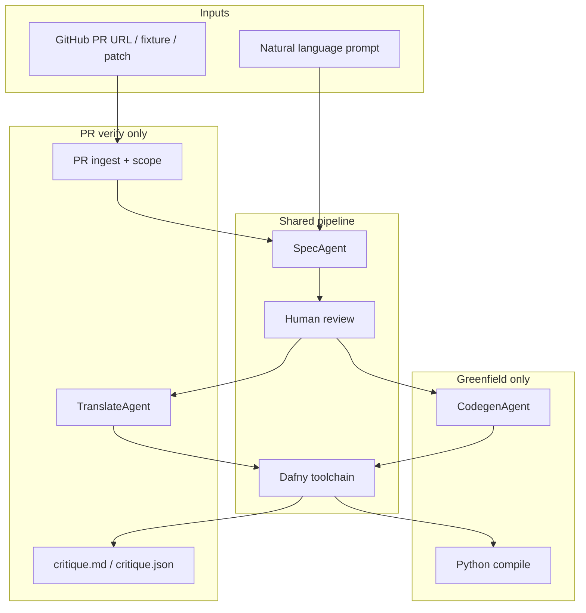

# vericode documentation

vericode is a CLI for AI-assisted **verified code generation** via [Dafny](https://github.com/dafny-lang/dafny). It supports two workflows:

| Workflow | Entry point | Goal |
|----------|-------------|------|
| [Verified Codegen](verified-codegen.md) | `vericode new "..."` | Turn a natural-language request into provably correct Dafny, then compile to Python |
| [PR Verification](pr-verification.md) | `vericode pr <url>` | Extract a formal contract from a GitHub PR, then prove or critique the PR's code against it |

Both workflows share the same core engine: **formal spec → human review → Dafny verify → artifacts**.

## Quick start

```bash
# Prerequisites: Dafny on PATH, OPENAI_API_KEY set
vericode check

# Greenfield verified codegen
vericode new "Return the maximum of two integers"

# PR verification (requires gh CLI for live GitHub URLs)
vericode pr https://github.com/org/repo/pull/123 --focus src/util.py:max_value

# HumanEval benchmark
vericode bench humaneval --spec-model gpt-5.5 --codegen-model gpt-5.5
```

## Architecture overview



## Session artifacts

All work is stored under `.vericode/sessions/<session_id>/`:

| File | Greenfield | PR verify |
|------|:------------:|:---------:|
| `prompt.txt` | ✓ | ✓ (rendered PR summary) |
| `context.json` | | ✓ |
| `source/` | | ✓ (before/after snapshots) |
| `internal_spec.dfy` | ✓ | ✓ |
| `draft_spec.md` | ✓ | ✓ |
| `verified_spec.md` | ✓ | ✓ |
| `implementation.dfy` | ✓ | ✓ |
| `translation.dfy` | | ✓ |
| `verify.log` | ✓ | ✓ |
| `final.py` | ✓ | |
| `critique.md` / `critique.json` | | ✓ |

## Further reading

- [Verified Codegen — detailed plan](verified-codegen.md)
- [PR Verification — detailed plan](pr-verification.md)
