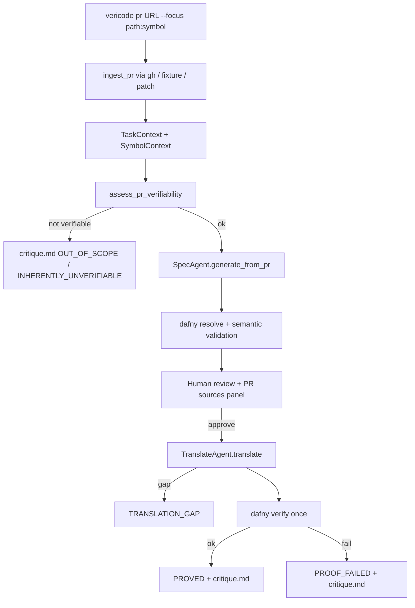

# PR Verification

Verify and critique **existing code in a GitHub pull request** against a formally generated Dafny specification.

Unlike [Verified Codegen](verified-codegen.md), this workflow does **not** invent a fresh implementation. It:

1. Ingests PR context (description, diff, comments)
2. Formalizes a behavioral contract (human-approved)
3. **Translates** the scoped PR code to Dafny faithfully
4. Attempts a **single proof** (no auto-repair of PR logic)
5. Emits a **critique report** when proof fails or the PR is unverifiable

## Goal

```
GitHub PR → formal spec (human-approved) → faithful translation → prove or critique
```

Success means: *the PR's logic, as written, satisfies the agreed contract*. Failure is informative — it may indicate a bug, a spec mismatch, or inherent unverifiability.

## End-to-end flow



## CLI

```bash
# Live GitHub PR (requires gh auth)
vericode pr https://github.com/org/repo/pull/123 \
  --focus src/util.py:max_value

# Verifiability check only (no OpenAI, no spec generation)
vericode pr https://github.com/org/repo/pull/123 \
  --focus src/util.py:max_value \
  --check-only

# Offline fixture (CI / tests)
vericode pr --fixture tests/fixtures/pr/python_max.json \
  --focus src/math.py:max_value

# Local patch + metadata
vericode pr --patch pr.diff --meta pr_meta.json --focus src/foo.py:bar

# Stop after spec review
vericode pr <url> --focus ... --skip-run

# Not recommended for PRs
vericode pr <url> --focus ... --auto
```

### Required: `--focus`

v1 verifies **one scoped symbol** per session (e.g. `src/util.py:max_value`). Without focus, ingest suggests candidates from translatable symbols in the diff.

## Pipeline stages

### 1. PR ingestion

[`ingest_pr()`](../src/vericode/sources/github.py) builds a [`TaskContext`](../src/vericode/models.py):

| Field | Source |
|-------|--------|
| `title`, `body`, `author`, `url` | PR metadata |
| `files[]` | Changed files with patch hunks |
| `comments[]` | Issue-level discussion |
| `review_comments[]` | Inline review threads |
| `focus` | User-selected `ScopedSymbol` |
| `verification_scope` | `"path:symbol"` string |
| `pr_shape` | `pure_function`, `observability`, `web_framework`, etc. |

Ingest modes:

- **GitHub URL** — `gh api` for PR, files, comments
- **Fixture JSON** — recorded PRs under `tests/fixtures/pr/`
- **Patch + meta** — local unified diff with metadata JSON

Session artifacts ([`create_pr_session()`](../src/vericode/artifacts/store.py)):

- `context.json` — full structured context
- `source/` — per-file before/after snapshots
- `symbol_context.json` — evidence-derived interface (see below)

### 2. Verifiability pre-check

[`assess_pr_verifiability()`](../src/vericode/sources/verifiability.py) runs **before** spec generation:

- PR shape classification (`feasibility_precheck`)
- Pattern scan for unsupported constructs (HTTP, ORM, logging, `fetch`, DOM, etc.)
- Observability-only intent detection from title/body
- Pure-algorithm heuristic on scoped source

If not verifiable → immediate `critique.md` / `critique.json` with outcome `OUT_OF_SCOPE` or `INHERENTLY_UNVERIFIABLE`. No OpenAI calls.

Use `--check-only` to stop here after a passing assessment.

### 3. Symbol context (deterministic)

[`analyze_symbol_context()`](../src/vericode/sources/symbol_context.py) extracts evidence **without LLM**:

- `abstract_parameters` — parameters that must be abstracted for Dafny (e.g. framework types → `int`)
- `external_constants` — module-level names referenced by scoped code
- `test_oracles` — conditions from changed test files
- `unresolved_names` — imports or names that may block faithful translation

This feeds both spec generation and translation prompts.

### 4. Spec generation (evidence fusion)

**Important:** vericode does **not** reverse-engineer specs purely from AST. Extraction is **abductive formalization** — the SpecAgent fuses multiple evidence sources:

| Source | Role |
|--------|------|
| PR description / issue | **Authoritative intent** |
| Review comments | **Additional requirements** |
| Code diff (after version) | **Observed behavior hypothesis** |
| Test oracles | **Concrete examples** |
| Base (before) | **Delta context** |

[`SpecAgent.generate_from_pr()`](../src/vericode/llm/spec_agent.py) uses `spec_system_pr.txt` and `render_pr_prompt()`.

**Conflict detection:** when description, comments, and code disagree, `notes` in `draft_spec.md` lists each conflict. The agent must **not** silently formalize buggy code as the spec. Human review picks the contract to verify against.

**Semantic validation:** [`validate_spec_semantics()`](../src/vericode/dafny/spec_semantics.py) checks the skeleton against `SymbolContext` (parameter types, arity). Mismatches trigger spec repair or post-approval `SPEC_UNFORMALIZABLE` critique.

### 5. Human review (mandatory by default)

[`review_spec()`](../src/vericode/review/interactive.py) shows:

- `draft_spec.md` — plain-English contract + notes
- **Sources panel** — PR title, focused hunk, top comments ([`format_sources_panel()`](../src/vericode/review/pr_sources.py))

`--auto` is discouraged for PRs: the spec is inferred from code that may be wrong.

### 6. Translation (not codegen)

[`TranslateAgent.translate()`](../src/vericode/llm/translate_agent.py):

- Input: approved spec + skeleton + scoped source + `SymbolContext`
- Language-specific system prompt via [`get_translator()`](../src/vericode/llm/translators/) (Python, TypeScript)
- **Faithful translation** — preserve PR control flow; do not fix bugs
- `can_translate()` pre-check → `TranslationGapError` if unsupported constructs detected
- Writes `translation.dfy` (first attempt) and `implementation.dfy`

**Verify-only:** no repair loop. One `dafny verify` call. PR logic is not mutated to force a proof.

**Sanitize policy:** `skip_benchmark_injection=True` in verify_pr mode — HumanEval-specific implementation fixes in [`sanitize.py`](../src/vericode/dafny/sanitize.py) are disabled so real PR defects are not masked.

### 7. Critique report

Primary deliverable for non-proof outcomes. Written to `critique.md` and `critique.json`.

[`CritiqueReport`](../src/vericode/models.py) includes:

| Field | Content |
|-------|---------|
| `outcome` | Category enum (below) |
| `summary` | One-line human summary |
| `findings[]` | Verifier errors, spec clauses, PR locations, unresolved comments |
| `verified` | `true` only for `PROVED` |

Session status:

- `PROVED` → `done`
- All other outcomes → `done_with_findings` (critique is the intended artifact, not a hard failure)

## Outcome categories

| Outcome | Meaning | Typical action |
|---------|---------|----------------|
| `PROVED` | Translation verifies against approved spec | Higher merge confidence |
| `SPEC_REJECTED` | Human aborted during review | Revise PR description or re-run |
| `SPEC_UNFORMALIZABLE` | Skeleton won't resolve or doesn't match PR evidence | Clarify PR; narrow scope |
| `OUT_OF_SCOPE` | Unsupported PR shape; no focus symbol | Use `--focus`; smaller PR |
| `TRANSLATION_GAP` | Source language feature can't map to Dafny | Extend translator; manual review |
| `PROOF_FAILED` | Faithful translation exists; verifier can't close | Bug, missing lemma, or hard proof |
| `SPEC_CODE_MISMATCH` | Spec contradicts observable diff behavior | Fix PR or revise spec |
| `RESOURCE_LIMIT` | Verify timeout / SMT blow-up | Simplify; mark inconclusive |
| `INHERENTLY_UNVERIFIABLE` | I/O, async, opaque libs, framework glue | Tests-only fallback |

## When PR code is not verifiable

### Inherent limitations (v1)

1. **I/O and environment** — HTTP, DB, filesystem, env vars, logging
2. **Concurrency / async** — threads, `asyncio`, locks
3. **Exceptions as control flow** — `try/except` for logic paths
4. **Dynamic / reflective code** — `eval`, `getattr`, heavy decorators
5. **Third-party dependencies** — numpy, Django ORM, opaque SDKs
6. **Stateful OO across files** — class invariants not visible in diff alone
7. **Loops without invariants** — faithful `while` translation needs invariants PR code lacks
8. **Float tolerance** — "approximately equal" without epsilon in spec
9. **Underspecified PRs** — "fix bug" with no description, tests, or comments
10. **Refactor-only** — rename/move with no semantic change
11. **Observability-only** — logging additions with no behavior change

### What extraction is NOT

- Weakest liberal precondition / strongest postcondition synthesis from code alone
- Guarantee of complete spec without human review
- Proof that spec matches author intent when PR is silent

### Pipeline behavior on failure

- **Does not** fall back to greenfield `CodegenAgent.fix()` loop
- **Does** emit actionable `critique.md` for every non-`PROVED` category
- **Optional future:** run PR's own tests against compiled translation to separate "proof hard" from "behavior wrong"

## Comparison with Verified Codegen

| Aspect | Verified Codegen | PR Verification |
|--------|------------------|-----------------|
| Input | `prompt.txt` | `context.json` + scoped symbol |
| Spec source | NL only | Description + diff + comments |
| Post-approval | `CodegenAgent` invents code | `TranslateAgent` mirrors PR |
| Verify retries | Up to `max_retries` with fix loop | Single verify, no logic repair |
| Success artifact | `final.py` | `critique.md` (proof or findings) |
| Sanitize injection | Enabled (benchmark patterns) | Disabled |
| Human review | Recommended | **Required** (default) |
| `verification_mode` | `greenfield` | `verify_pr` |

## Shared infrastructure

Both workflows reuse:

- [`SessionStore`](../src/vericode/artifacts/store.py) — session dirs, logs, status
- [`SpecAgent`](../src/vericode/llm/spec_agent.py) — skeleton generation (different system prompts)
- [`sanitize_dafny_skeleton()`](../src/vericode/dafny/sanitize.py) — parse/type repair (`pr_mode` flag)
- [`dafny verify`](../src/vericode/dafny/toolchain.py) — proof engine
- [`EnsuresWeakenedError`](../src/vericode/llm/codegen_agent.py) — contract preservation guard
- Interactive review gate

## Key modules

| Module | Role |
|--------|------|
| [`pipeline.py`](../src/vericode/pipeline.py) | `new_pr_session()`, `run_pr_verification()` |
| [`sources/github.py`](../src/vericode/sources/github.py) | PR fetch and ingest |
| [`sources/context.py`](../src/vericode/sources/context.py) | TaskContext building, symbol extraction |
| [`sources/verifiability.py`](../src/vericode/sources/verifiability.py) | Pre-check feasibility |
| [`sources/symbol_context.py`](../src/vericode/sources/symbol_context.py) | Deterministic interface analysis |
| [`llm/translate_agent.py`](../src/vericode/llm/translate_agent.py) | Faithful source → Dafny |
| [`llm/translators/`](../src/vericode/llm/translators/) | Per-language translation prompts |
| [`review/critique.py`](../src/vericode/review/critique.py) | Report generation |
| [`review/pr_sources.py`](../src/vericode/review/pr_sources.py) | Review UX sources panel |
| [`dafny/spec_semantics.py`](../src/vericode/dafny/spec_semantics.py) | Spec vs evidence validation |

## Test fixtures

Recorded PRs for offline testing:

```
tests/fixtures/pr/python_max.json      # provable pure Python
tests/fixtures/pr/typescript_sum.json  # TypeScript function
tests/fixtures/pr/python_async_gap.json # translation gap
tests/fixtures/pr/posthog_error_response.json # framework / I/O
tests/fixtures/pr/slack_response_style.json   # observability intent
```

Tests: `tests/test_pr_ingest.py`, `tests/test_pr_verify.py`, `tests/test_pr_pipeline_mocked.py`

## Design principles

1. **Verify the PR, not a rewrite** — translation preserves PR logic; no silent bug-fixing.
2. **Spec is a hypothesis** — grounded in evidence, confirmed by human review, tested by proof.
3. **Failures are findings** — `done_with_findings` + critique is a successful run when proof fails.
4. **Early rejection** — verifiability pre-check avoids expensive LLM on hopeless PRs.
5. **No benchmark inflation** — implementation injection sanitizers disabled in verify_pr mode.
6. **Single-symbol scope** — one entry point per session keeps tokens and proof obligations bounded.

## Implemented vs planned

### Implemented (v0.1)

- `vericode pr` CLI with URL, fixture, patch modes
- `--focus`, `--check-only`, `--skip-run`
- Full pipeline: ingest → precheck → spec → review → translate → verify → critique
- Python and TypeScript translators
- Outcome categories and critique artifacts
- Semantic spec validation against symbol context

### Planned (future phases)

- Multi-symbol scope in one session
- Inline comment anchoring in critique (file:line from diff map)
- Run PR's own tests against compiled translation when proof fails
- GitHub Action / PR comment bot posting critique
- `DONE_WITH_FINDINGS` webhook integration
- Broader language support beyond Python/TypeScript

## Example session layout

```
.vericode/sessions/abc123def456/
├── meta.json              # source_type=github_pr, verification_mode=verify_pr
├── prompt.txt             # rendered PR summary for logs
├── context.json           # full TaskContext
├── symbol_context.json    # interface evidence
├── source/                # file snapshots
├── internal_spec.dfy
├── draft_spec.md
├── verified_spec.md
├── translation.dfy        # first translation attempt
├── implementation.dfy
├── verify.log
├── critique.md            # primary PR-mode deliverable
└── critique.json
```
