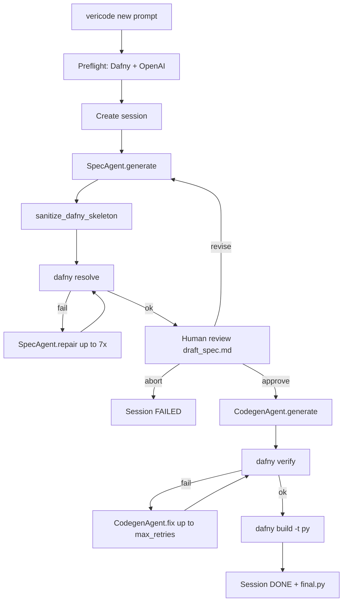

# Verified Codegen

Greenfield workflow: given a **natural-language programming request**, vericode produces a **formally verified Dafny implementation** and compiles it to Python.

## Goal

```
NL prompt → Dafny spec (human-approved) → verified implementation → final.py
```

The human approves the behavioral contract before any implementation is generated. Dafny proves the implementation satisfies `requires` / `ensures`. The result is executable Python with a machine-checked proof attached to the Dafny source.

## End-to-end flow



## CLI

```bash
vericode new "Implement binary search on a sorted array of integers"

# Options
vericode new "..." \
  --spec-model gpt-4o-mini \
  --codegen-model gpt-4o \
  --max-retries 5 \
  --auto          # skip interactive review (benchmark/dev only)
  --skip-run      # stop after spec review, no codegen
```

### Related commands

| Command | Purpose |
|---------|---------|
| `vericode review` | Approve or revise a pending spec |
| `vericode run` | Run codegen on an approved spec |
| `vericode resume <id>` | Continue an interrupted session |
| `vericode list` | List recent sessions |
| `vericode check` | Verify toolchain configuration |

## Pipeline stages

### 1. Session creation

`Pipeline.new_session()` ([`pipeline.py`](../src/vericode/pipeline.py)):

- Runs preflight (Dafny binary, `OPENAI_API_KEY`)
- Creates `.vericode/sessions/<id>/` via [`SessionStore`](../src/vericode/artifacts/store.py)
- Writes `prompt.txt`, `meta.json` with `source_type=nl`, `verification_mode=greenfield`
- Immediately runs spec generation and interactive review

### 2. Spec generation (SpecAgent)

[`SpecAgent`](../src/vericode/llm/spec_agent.py) uses `spec_system.txt` and few-shot examples to produce:

| Output | Stored as | Purpose |
|--------|-----------|---------|
| `internal_dafny` | `internal_spec.dfy` | Hidden Dafny skeleton |
| `nl_summary` | `draft_spec.md` | Human-readable contract |
| `notes` | appended to `draft_spec.md` | Ambiguities and discrepancies |

**Required skeleton shape:**

```dafny
function ProblemSpec(...): T
  requires ...
  decreases ...   // when recursive
{
  if ... then ... else ...
}

method Problem(...) returns (result: T)
  requires ...
  ensures result == ProblemSpec(...)
{
  assume false;
}
```

**Rules enforced by prompts and sanitization:**

- Postconditions on the **method only** — never on `function`
- No `while`, `for`, or imperative constructs inside pure functions
- Recursive helpers need `requires` / `decreases` for termination
- Method body is `{ assume false; }` until codegen fills it in

### 3. Spec sanitization and resolve gate

Before human review, the skeleton must pass **`dafny resolve`** (parse + type-check), not full verification:

```python
resolve(internal_spec.dfy, allow_warnings=True)
```

[`sanitize_dafny_skeleton()`](../src/vericode/dafny/sanitize.py) repairs common LLM mistakes:

- `ensures` on functions → stripped
- Python-style `abs()` → `if x < 0 then -x else x`
- `while` inside functions → stubbed or rewritten
- Missing `decreases` / index bounds `requires`
- Benchmark-specific pattern fixes (`MakeAPile`, `WordsString`, `f`, etc.)

If resolve fails, `SpecAgent.repair()` runs up to **7 attempts** with verifier output and `repair_hints()`.

### 4. Human review (mandatory by default)

[`review_spec()`](../src/vericode/review/interactive.py) displays `draft_spec.md` and offers:

- **Approve** — copies to `verified_spec.md`, status → `verified_spec`
- **Revise** — feedback appended to `meta.revision_feedback`, spec regenerated
- **Abort** — session failed

This gate ensures the formal contract matches human intent before codegen spends tokens.

### 5. Codegen (CodegenAgent)

[`CodegenAgent.generate()`](../src/vericode/llm/codegen_agent.py):

- Input: `verified_spec.md` + `internal_spec.dfy`
- Output: complete `implementation.dfy`
- Preserves all `requires` / `ensures` from the skeleton (`ensures_preserved` guard)
- Applies `prepare_source()`: skeleton merge + implementation sanitization

**Repair loop:** on verify failure, `CodegenAgent.fix()` runs up to `max_verify_retries` (default 5). The agent may change implementation logic but **cannot weaken ensures**.

### 6. Dafny verification

```bash
dafny verify implementation.dfy
```

Errors are parsed into structured `DafnyError` objects and fed back to the codegen repair loop via `format_errors_for_llm()`.

### 7. Python compilation

On successful verification:

```bash
dafny build -t py implementation.dfy
```

Output is copied to `final.py` and `output/generated/` under the session directory.

## Session status lifecycle

```
draft_spec → awaiting_review → verified_spec → generating_dafny → verifying → compiling → done
                                                                    ↘ failed
```

## HumanEval benchmark

The benchmark reuses the greenfield pipeline with `--auto` (no interactive review):

```bash
# Full 164 tasks
vericode bench humaneval --spec-model gpt-5.5 --codegen-model gpt-5.5

# Resume after interrupt (default)
vericode bench humaneval --spec-model gpt-5.5 --codegen-model gpt-5.5

# Fresh run
vericode bench humaneval --no-resume --spec-model gpt-5.5 --codegen-model gpt-5.5

# Full-dataset summary (not just the current run)
vericode bench humaneval --summary-only
```

Results are stored in `.vericode/bench/humaneval/results.jsonl` (one row per `task_id`, upserted in place).

### Benchmark evaluation pipeline

After a task reaches `DONE`:

1. `dafny build -t py` produces a Python module tree
2. [`dafny_adapter.py`](../src/vericode/bench/dafny_adapter.py) converts HumanEval Python values ↔ Dafny runtime types (`_dafny.Seq`, datatype wrappers)
3. Official HumanEval `check()` tests run against the compiled method

### Metrics

| Metric | Meaning |
|--------|---------|
| Spec OK | Spec skeleton resolved (possibly after repair) |
| Dafny verified | `dafny verify` passed |
| Compiled | `final.py` exists |
| HumanEval tests passed | Official tests pass via adapter |
| Pipeline done | Session status `done` |

## Key modules

| Module | Role |
|--------|------|
| [`pipeline.py`](../src/vericode/pipeline.py) | Orchestrates the full workflow |
| [`spec_agent.py`](../src/vericode/llm/spec_agent.py) | NL → Dafny skeleton |
| [`codegen_agent.py`](../src/vericode/llm/codegen_agent.py) | Skeleton → verified implementation |
| [`sanitize.py`](../src/vericode/dafny/sanitize.py) | LLM output repair |
| [`toolchain.py`](../src/vericode/dafny/toolchain.py) | `resolve`, `verify`, `build_python` wrappers |
| [`humaneval_runner.py`](../src/vericode/bench/humaneval_runner.py) | Batch benchmark driver |

## Design principles

1. **Spec before code** — implementation is generated only after explicit human approval of the contract.
2. **Proof before ship** — `dafny verify` is the quality gate; Python compile is a secondary artifact.
3. **No weakened contracts** — `EnsuresWeakenedError` blocks codegen that strips `ensures`.
4. **Conservative formalization** — ambiguities surface in `notes`, not silent assumptions.
5. **Sanitization as repair, not semantics** — sanitizers fix syntax/shape; benchmark-specific implementation injection is allowed in greenfield mode only.

## Limitations

- **Single-function bias** — optimized for HumanEval-shaped problems (one entry method, pure logic).
- **LLM-dependent** — spec and codegen quality depend on model choice (`gpt-4o-mini` / `gpt-4o` defaults; `gpt-5.5` for benchmarks).
- **Dafny expressiveness** — floats, heavy I/O, and concurrency are out of scope for reliable verification.
- **Sanitize injection** — name-triggered fixes in `sanitize.py` can inject known-correct implementations for specific HumanEval patterns; this inflates benchmark scores but does not cheat on tests.

## Future improvements

- Richer few-shot library per problem domain
- Stronger spec semantic validation before review
- Optional `--filter` for benchmark subsets
- Configurable sanitize policy (strict vs benchmark-assisted)
- Default models aligned with best benchmark results
